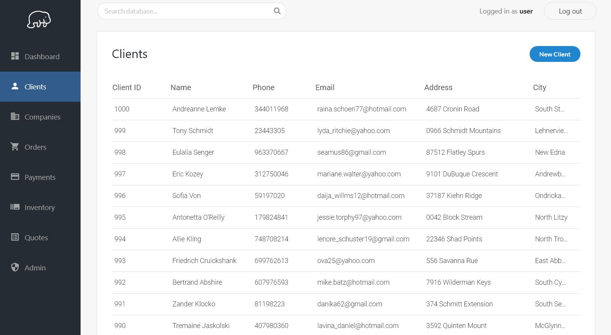
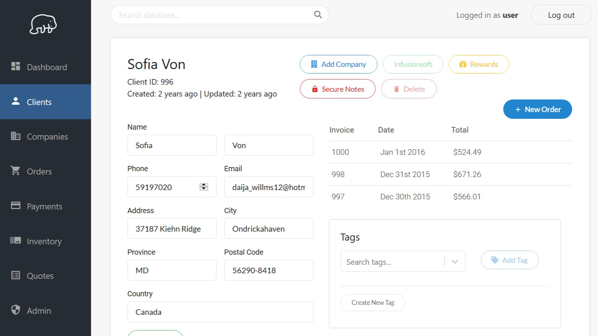
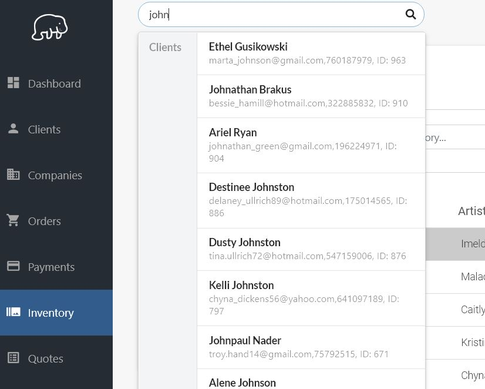
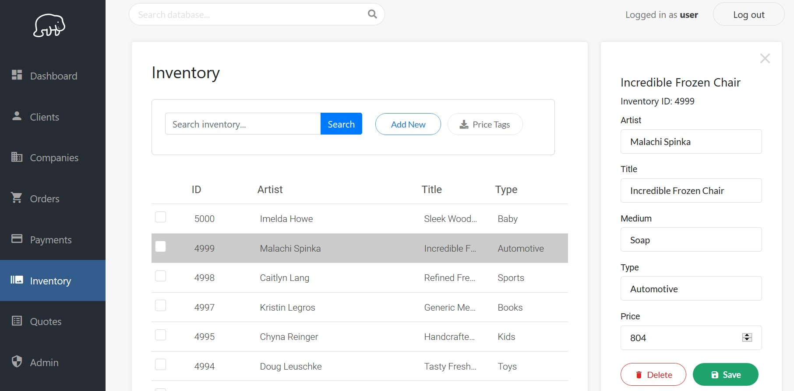

# Manatee

Front-end for a client, order, and inventory management system. Built with React.

Other features include tags (for marketing segmentation), companies, payments, quotes, instant search, and downloading inventory data as formatted .doc file for printing "price tags".

**[Back-end](https://github.com/martin-gv/manatee-api)** is Node and MongoDB.

## Screenshots

### Client list

### Client view

### Search

### Inventory

